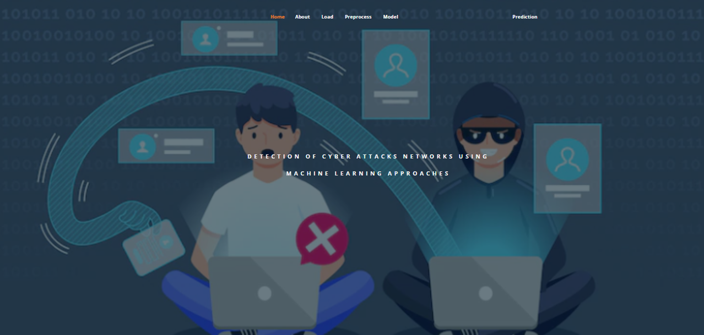
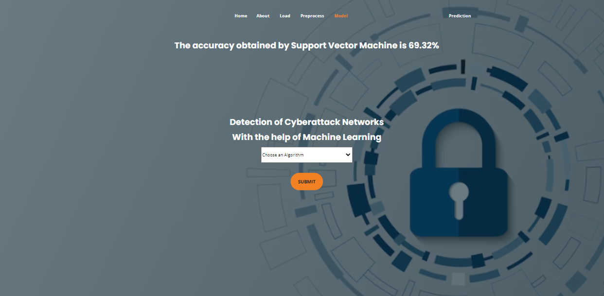
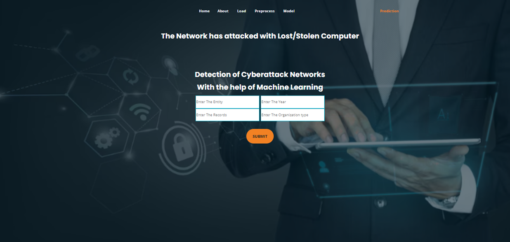

# 🚨 Cyber Attack Detection using Machine Learning

## 📌 Project Overview

This project detects cyber attacks in network systems using machine learning models such as Random Forest, SVM, ANN, and CNN.

## 🧠 Key Features

* Web-based interface using Flask
* Multiple ML models comparison
* Real-time prediction of attack type
* User-friendly UI with Bootstrap
* Docker support for deployment

## ⚙️ Tech Stack

* Python
* Flask
* Scikit-learn
* TensorFlow / Keras
* Bootstrap
* Docker

## 🔄 Workflow

1. Upload dataset
2. Preprocess data
3. Train ML models
4. Evaluate accuracy
5. Predict cyber attack type

## 🤖 Models Used

* Random Forest (Accuracy: 90.53%)
* Support Vector Machine
* Artificial Neural Network
* Convolutional Neural Network

## 📊 Dataset

* DataBreaches (2004–2021)

## ▶️ How to Run

```bash
pip install -r requirements.txt
python app.py
```
## 📸 Output Screenshots

### Home Page


### Model Accuracy


### Prediction Result


## 🚀 Future Improvements

* Save trained models using Pickle
* Add real-time attack detection
* Improve model accuracy

## 👨‍💻 Author

Shahid
